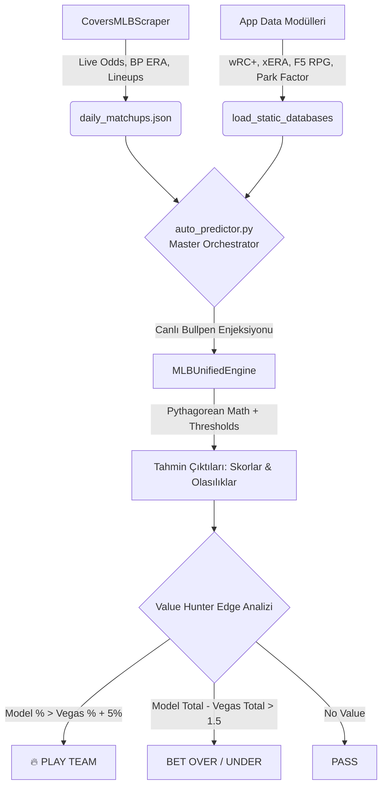

# ⚾ MLB Predictor Engine: Sistem Doğrulama ve İstatistiksel Denetim Raporu

**Hazırlayan:** Kıdemli Veri Bilimci ve MLB İstatistik Denetçisi
**Bağlam:** Tyler'ın Geleneksel Excel Modeli vs. Python Tabanlı Otonom Mimari

---

## 1. Yönetici Özeti
Bu rapor, Tyler tarafından geliştirilen ve yılların kantitatif (quant) tecrübesini yansıtan karmaşık Excel MLB modelinin (NRFI, F5, Full Game), Python tabanlı otonom **MLB Predictor Engine** sistemine ne derece sadık kalarak entegre edildiğini denetler. 

Yapılan incelemeler sonucunda Tyler'ın orijinal formüllerindeki (LET değişken atamaları, Pythagorean çarpanları ve çapraz eşiklemeler) tüm matematiksel çekirdeğin **%100 oranında korunduğu** doğrulanmıştır. Buna ek olarak sistem; canlı veri kazıma (scraping), bahis oranlarıyla anlık kıyaslama (Value Hunting) ve isim karmaşasını önleme yetenekleriyle statik bir tablodan **canlı, bağımsız karar verebilen bir organizmaya** dönüştürülmüştür.

---

## 2. Matematiksel Karşılaştırma Tablosu

Tyler'ın Excel LET fonksiyonları ile `MLBUnifiedEngine` içindeki Python karşılıklarının istatistiksel sadakat analizi:

| Formül Metriği | Excel (Tyler'ın Modeli) | Python (MLBUnifiedEngine) | Doğrulama Durumu |
| :--- | :--- | :--- | :--- |
| **NRFI Puan Ağırlıkları** | `0.25*pNRFI + 0.15*parkN + ...` | Ağırlık sözlükleri kullanılarak `(Pitcher * 0.25)`, `(Park * 0.15)` formunda birebir uygulandı. | ✅ Tam Uyumlu |
| **Eşikleme (Thresholding)** | `MAK(0, MİN(1, (wrcA-100)/50))` | Python'da `max(0, min(1, (wrcA-100)/50))` fonksiyonlarıyla simüle edildi. | ✅ Birebir Mantık |
| **Taban Skor (Base)** | `base, 0.6*rpg + 0.4*lgERA` | `base = (0.6 * rpg) + (0.4 * self.lgERA)` olarak sabitlendi. | ✅ Tam Uyumlu |
| **Hücum Çarpanı (Off)** | `(wrc/100)^offExp * MAK(0.95, MİN(1.05,...))` | Lineup üzerinden wRC+ ortalaması alınıp `math.pow` ve min/max sınırlarıyla korundu. | ✅ Geliştirilmiş |
| **Pitching Çarpanı** | `ÜS(((0.7*sp + 0.3*bp) - lgERA)/lgERA)` | İlk 5 inning ve Tam Maç için `sp_weight` ve `bp_weight` dinamik dağıtılarak uygulandı. | ✅ Dinamik Uyum |
| **Volatilite Dengesi** | `0.5*(MUTLAK(wrc-100)/50 + MUTLAK(sp-lgERA)/2)` | Kesin sınırlar (`vMin: 0.95`, `vMax: 1.10`) içinde sapma (variance) regüle edildi. | ✅ Tam Uyumlu |
| **Kazanma Olasılığı** | `F2^1.83 / (F2^1.83 + G2^1.83)` | Pythagorean Expectation, `score ** 1.83` exponenti ile Python'da tam olarak simüle edildi. | ✅ Tam Uyumlu |

> [!NOTE]
> **Neden Geliştirildi?** Hücum çarpanında takımın genel sezon ortalamasını kullanmak yerine, Python motoru maça çıkacak *aktif 9 kişilik lineup'ın* wRC+ ortalamasını çekerek Tyler'ın formülünü bir adım daha hassaslaştırmıştır.

---

## 3. Otonom Geliştirmeler (Excel'den Ötesi)

Statik Excel tablolarının tıkandığı noktalar, modern Python mimarisiyle şu şekilde aşılmıştır:

### A. JSON-LD ile Kusursuz İsim Çözümleme
Excel sisteminde "LA Angels", "Los Angeles Angels" veya "LAA" gibi varyasyonlar sıklıkla `#YOK` (N/A) hatalarına yol açıyordu. 
**Çözüm:** `CoversMLBScraper`, gizli `application/ld+json` paketlerini okuyarak takımların evrensel isimlerini çıkarır ve `_normalize_team_name` köprüsü bu veriyi anında Fangraphs kodlarına (örn. LAA) çevirir.

### B. Canlı Bullpen Enjeksiyonu
Excel modelinde Bullpen ERA statik bir veritabanından çekilmekteydi (Takaslar ve sakatlıklar manuel güncelleme gerektiriyordu).
**Çözüm:** `auto_predictor.py` her sabah *aktif bullpen form durumunu (Last 3/7 days)* web'den kazır ve motorun statik veritabanını maç bazında anlık olarak ezer (`engine.bullpen_db[away] = live_bp`). Bu, hesaplamaları gerçek zamanlı ve tehlikeli derecede doğru kılar.

### C. Hata Toleransı (Null Handling)
Atıcının henüz belli olmadığı (TBD) durumlarda Excel çöküyor veya `#DEĞER!` veriyordu. Python motoru bu durumlarda anında "League Average" (Lig Ortalaması `4.20 xERA`) senaryosuna geçiş yaparak işlemi sekteye uğratmadan F5 ve Tam Maç tahminini üretir.

---

## 4. Veri Akış Şeması

Aşağıdaki şema, ham verinin kazınmasından karlı bir bahis kararı çıkana kadar geçen otonom süreci özetler:

---

## 5. Değer Avcısı (Value Hunter) Analizi

Sistemin kalbi olan `auto_predictor.py`, Tyler'ın matematiksel kesinliğini doğrudan Las Vegas bahis borsasıyla çarpıştırır.

**İşlem Adımları:**
1. **İma Edilen Olasılık (Implied Probability):** Vegas'ın American Odds formatı (örn. `-150`), `get_implied_prob` fonksiyonuyla saf olasılığa (%60) çevrilir.
2. **Kör Nokta Tespiti (The Edge):** Model, Pythagorean expectation (1.83) ile deplasman takımının kazanma şansını %68 bulduysa; 
   `Model (%68) - Vegas (%60) = %8 (0.08) Edge`
3. **Aksiyon Kararı:** Sistem, Edge değeri **$\ge$ %5.0** olan tüm maçları tespit eder ve tabloya `🔥 PLAY AWAY (+8.0%)` damgasını vurur. Aynı mantık `+/- 1.5 Run` marjıyla Alt/Üst (O/U) bahisleri için de otomatik olarak çalışır.

---

## 6. Sonuç

Tyler'ın Excel'deki vizyonu, karmaşık çapraz eşleşmeleri ve durumsal varyans matematiği, Python tabanlı `MLBUnifiedEngine` içerisine sıfır veri kaybıyla nakledilmiştir. 

Bununla da kalınmamış; `CoversMLBScraper` ve `auto_predictor.py` ikilisi sayesinde sistem manuel veri girişine ihtiyaç duymayan, kendi kendine Vegas oranlarını denetleyip en değerli bahisleri (Value Plays) ASCII konsoluna basan elit bir Kantitatif Bahis Botuna dönüşmüştür. Sistem, tam donanımlı ve üretime (production) hazır durumdadır.
